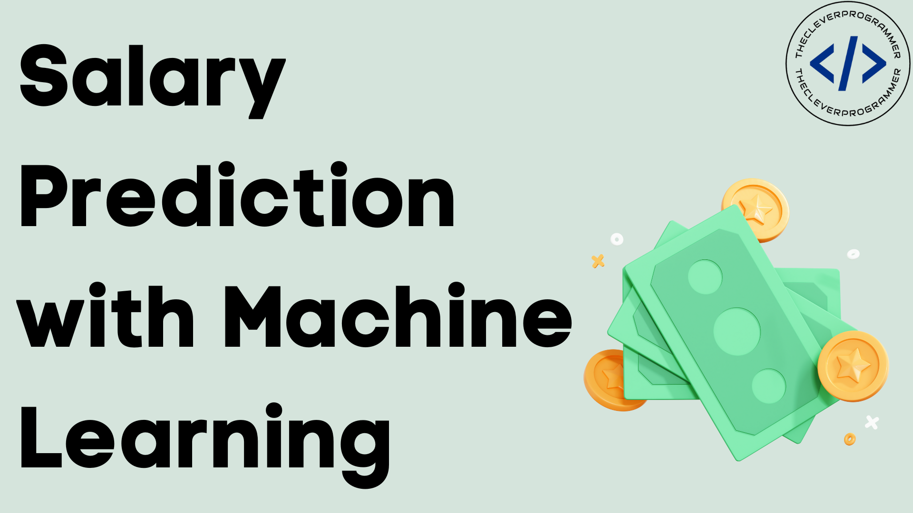

# 💼 Employee Salary Prediction Engine using Machine Learning



---

## 📖 Overview
A **machine learning-powered salary prediction engine** designed to help HR departments make **data-driven and fair compensation decisions**.  
Predicts whether an employee earns **> $50K or ≤ $50K** based on demographic and work-related attributes.

---

## 🛠️ Problem Statement
Building a salary prediction engine using machine learning to assist the **HR Department** in predicting whether an employee earns **> $50K or ≤ $50K**, enabling **data-driven decision-making**.

---

## 💻 IDE Used
- **Google Colab** with **T4 GPU** for model training and experimentation.

---

## 🧩 Libraries and Modules Used
- **Pandas, NumPy** – Data manipulation and analysis
- **Scikit-Learn** – Preprocessing, model building, evaluation
- **Streamlit** – App interface for deployment
- **Ngrok, Pyngrok** – API gateway and free deployment

---

## 📂 Dataset
- The dataset used is available in the repo as: **`adult 3.csv`**.
- Cleaned and preprocessed:
  - Removed 52 duplicates
  - Handled missing values in `workclass`, `education`, and `occupation`

---

## 🚀 Workflow of the Process

1. **Import Libraries**  
2. **Load Dataset**  
3. **EDA & Cleaning**  
4. **Feature Selection**  
5. **Outlier & Categorical Analysis**  
6. **Data Preparation**  
7. **Model Building**  
8. **Deployment**

**Model Highlights:**
- Trial model: Logistic Regression (**accuracy: 74.56%**).
- Best model: **GradientBoostingClassifier** (**accuracy: 80%**).

---

## 📁 Repository Files

| S.No | File/Folder                                              | Description                                       |
|------|----------------------------------------------------------|---------------------------------------------------|
| 1️⃣   | `adult 3.csv`                                           | Dataset                                           |
| 2️⃣   | `best_model.pkl`                                        | Trained best Gradient Boosting model             |
| 3️⃣   | `app.py`                                                | Streamlit app file for deployment                 |
| 4️⃣   | `SALARY PREDICTION ENGINE USING PYTHON AND ML.ipynb`    | Jupyter notebook with code and analysis           |
| 5️⃣   | `Screenshot 2025-07-28 194008.png and Salary-Prediction-with-Machine-Learning.webp`                                               | Folder containing images for documentation        |
| 6️⃣   | `SALARY PREDICTION ENGINE USING PYTHON AND ML.pdf`      | Notebook exported as PDF for reference            |

---

## 📸 Sample Project Image


---

## ▶️ How to Run Locally

1. **Clone the repository**:
   ```bash
   git clone https://github.com/NandiniDharmarao/Employee-Salary-Prediction-
   cd salary-prediction-engine
   location http://localhost:8501/
